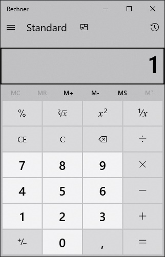
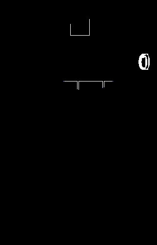

# ImageSharpCompare

Compares images

[](https://ci.appveyor.com/project/stesee/imagesharp-compare) [](https://www.nuget.org/packages/ImageSharpCompare/) [](https://www.codacy.com/manual/stesee/ImageSharp.Compare?utm_source=github.com&utm_medium=referral&utm_content=Codeuctivity/ImageSharp.Compare&utm_campaign=Badge_Grade) [](https://www.paypal.com/donate?hosted_button_id=7M7UFMMRTS7UE)

Inspired by the image compare feature "Visual verification API" of [TestApi](https://blogs.msdn.microsoft.com/ivo_manolov/2009/04/20/introduction-to-testapi-part-3-visual-verification-apis/) this code supports comparing images by using a tolerance mask image. That tolerance mask image is a valid image by itself and can be manipulated.

ImageSharpCompare focus on os agnostic support and therefore depends on [SixLabors.ImageSharp](https://github.com/SixLabors/ImageSharp).

```PowerShell
Install-Package ImageSharpCompare
```

## Example simple show cases

```csharp
bool isEqual = ImageSharpCompare.ImageAreEqual("actual.png", "expected.png");

// calcs MeanError, AbsoluteError, PixelErrorCount and PixelErrorPercentage
ICompareResult calcDiff = ImageSharpCompare.CalcDiff("actual.png", "expected.png");
```

## Example show case allowing some tolerated diff

Imagine two images you want to compare, and want to accept the found difference as at state of allowed difference.

### Reference Image


### Actual Image



### Tolerance mask image

using "compare.CalcDiff" you can calc a diff mask from actual and reference image

Example - Create difference image

```csharp
using (var fileStreamDifferenceMask = File.Create("differenceMask.png"))
using (var maskImage = ImageSharpCompare.CalcDiffMaskImage(pathPic1, pathPic2))
    SixLabors.ImageSharp.ImageExtensions.SaveAsPng(maskImage, fileStreamDifferenceMask);
```



Example - Compare two images using the created difference image. Add white pixels to differenceMask.png where you want to allow difference.

```csharp
var maskedDiff = ImageSharpCompare.CalcDiff(pathPic1, pathPic2, "differenceMask.png");
Assert.That(maskedDiff.AbsoluteError, Is.EqualTo(0));
```
